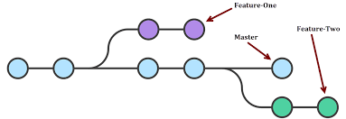
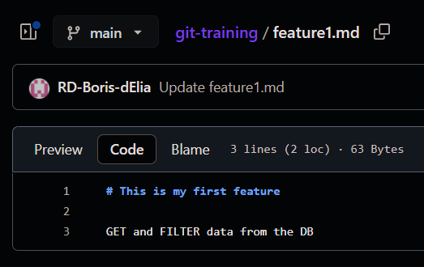

# Branches

The advantage of git, is that it allows for collaborative work. This is where branching is important.

## Main branch

Usually, you'll have a main branch which is your PROD ready, fullproof, fully tested, versioned and reviewed branch.

The main branch usually include :
1. A CI/CD pipeline to ensure it's fully tested
2. A build phase for your production environment
3. Protection rules to enforce code reviews on Pull Requests and no direct push allowed
4. A tagging system for versions

## Feature branches

Then, you'll have feature branches meant for isolating the development process from main.

Those branches allow to isolate the code in development to avoid code conflicts.

Let's play around those branches for a bit.

### My first branch

You need to create a branch named feature2, then set it as your current branch, and finally push the branch in the remote.

```
git branch feature2
git checkout feature2
git push
```



##### Note that `git branch` allows to list all current branches in your repository

After that, you have a second branch both in your remote and in your local repos.
Let's make a diff !

Start by running `git diff feature2 main`.

It does nothing it seems... Let's rerun it between those following steps :

1. Create a new file called feature2
2. Add some text in it
3. commit the file
4. push the file

### Create a change in main

##### We will now simulate the work of a collaborator, who applied some changes on the main branch.

You can add a newline in your feature1.md file directly on your main branch on github (this is not good practice).

Feature1.md should look like this :



Go back to your local branch and we now want to pull that change into your local repo.

1. Make sure you are still on your feature2 branch
```console
shell:~$ git branch
* feature2
  main
```
2. `git pull <remote name> <branch name>`
```console
shell:~$ git pull github main
From https://github.com/<user>/<repository>
 * branch            main       -> FETCH_HEAD
Updating bff7301..69bd9a7
Fast-forward
 feature1.md                   |   1 ++
```

You are now up to date with the latest main changes !


