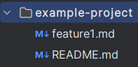

# Setup a new repository

The objective of this exercise is to sync a local and a remote (github) repository.

In both cases, you will need to create your github repository separately. You can start with that.

### Setup locally

```
cd <working directory>
git init
```


Then we need to link a remote repository to your local one. 

The remote name does not matter but is named "origin" by default whenever you clone a remote instead of adding it manually.

`git remote add <remote name> <repository url>`

##### Note that the first time you will try to read or write to the remote repo, github will ask for authentication.

### setup on github

This automatically adds your repository as your "origin" remote

 `git clone <your repo url> (your destination path/directory)`

## push your first file

Create a readme.md file with any text in it

```
git add .
git commit -m "my first commit"
git push
```
`git add` allows you to add files to the staging environment before syncing to a remote. the "." just means you add everything from the current working directory.

If you wish to add only specific files you can specify one or multiple files : `git add readme.md file2.json path/to/file3`.

 ##### Note : You can link your current local repo with a specific remote and branch by running `git branch --set-upstream-to <remote-name>/<branch-name>`

## pull changes from repository

Go to your github repo and create another file.

Call it "feature1.md" and write whatever suits you in it.

Then you want to pull that change to your local repo : `git pull`

#### At this point, you should have a local and a remote. Both containing 2 files and correctly synced (readme.md and feature1.md)


