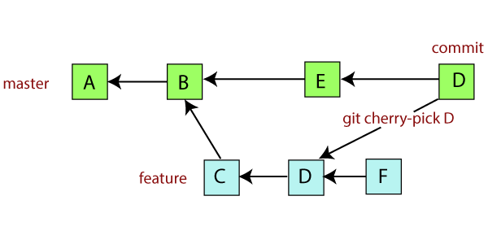
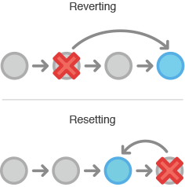

# Have a clean work tree

## Rebase

A rebase is, like a merge, an utility meant to help squash changes from one branch to another.

Except that a rebase will not create a single commit that will merge changes.
It will instead create a copy of the branch commit tree, and push it on top of your main branch.

Note that those commits have different hashes than the original ones.

This allows for a clean(er) and linear git history.

## Cherry-pick

A cherry-pick allows you to move one specific commit from one branch to another without impacting the branches or having to worry about merges.

Its usage is quite specific and be wary that a cherry pick might cause duplication issues. You have to be extra careful when using that command as it might lead to serious problems.

## Revert

Because sometimes, we've messed up. In case you committed a faulty change, you have the possibility to revert a commit.
It's a simple command that will create a new commit undoing all the changes from another commit.

It's especially useful in cases where you have multiple commits chained and you want to target specifically one of the older commits where you inserted a problem.
Other commits will be unaffected

## Reset

A git reset is similar to a git checkout that goes back in time. It will move your current state to a specific commit back in the history, **wiping** all the commits that were on top of it.
