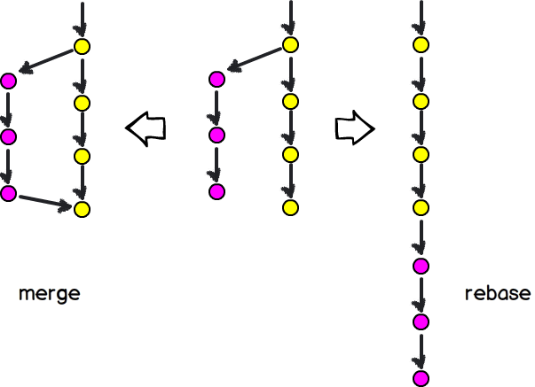

# Have a clean work tree

## Rebase

A rebase is, like a merge, an utility meant to help squash changes from one branch to another.

Except that a rebase will not create a single commit that will merge changes.
It will instead create a copy of the branch commit tree, and push it on top of your main branch.

